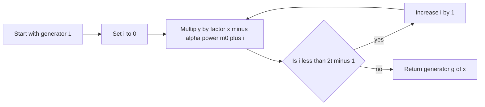

# Reed-Solomon Encoding (`encode`) and Generator Construction (`makeGenerator`)

This document explains exactly what your `RSCode.makeGenerator()` and `RSCode.encode()` implementations do in `CD_template/RSCode.py`.

---

## 1) Big Picture

The code implements a **shortened, systematic Reed-Solomon encoder** over `GF(2^m)`.

- Full RS code length: `n = 2^m - 1`
- Full information length: `k = n - 2t`
- Shortened information length: `l` (with `l <= k`)
- Shortened codeword length: `l + (n-k)`

Systematic means the message symbols appear unchanged in the codeword (in your implementation, at the front of the shortened codeword).

---

## 2) Parameter Meaning

- `m`: field degree, so symbols are in `GF(2^m)`.
- `t`: error-correction capability (up to `t` symbol errors).
- `n = 2^m - 1`: full codeword size.
- `k = n - 2t`: full message size.
- `l`: shortened message size.
- `m0`: first root index of generator polynomial.

`m0` does not change `n`, `k`, or `t`; it changes which equivalent RS code in the family you use.

---

## 3) How `makeGenerator(m, t, m0)` Works

### Mathematical target

The generator polynomial is:

\[
g(x) = \prod_{i=0}^{2t-1} (x - \alpha^{m0+i})
\]

where `alpha` is a primitive element of `GF(2^m)`.

### Why this form?

- It gives `2t` consecutive roots.
- Therefore `deg(g) = 2t = n-k`.
- This creates an RS code with designed distance `d_min >= 2t+1`, enabling correction of up to `t` symbol errors.

### What your code does

1. Builds `GF(2^m)` and gets primitive element `alpha`.
2. Starts from polynomial `1`.
3. For `i = 0..2t-1`, multiplies by `(x - alpha^(m0+i))`.
4. Returns final `g(x)` as `galois.Poly`.

### Visual



---

## 4) How `encode(msg)` Works

Your `encode()` builds a shortened systematic codeword row-by-row.

### 4.1 Input checks

- Checks column count is exactly `l`.
- Checks input type is elements of `GF(2^m)`.

So each row is one `l`-symbol message word.

### 4.2 Core encoding steps per row

Let:

- `n_par = n-k = 2t` parity symbols
- `pad = k-l` shortening pad

For each message row:

1. **Undo shortening temporarily**: prepend `pad` zeros to get full-length `k` message (`m_full`).
2. Convert `m_full` into message polynomial `M(x)`.
3. Multiply by `x^(n-k)` (shift left by parity length):
   \[
   M(x)x^{n-k}
   \]
4. Divide by `g(x)` and compute remainder:
   \[
   R(x) = (M(x)x^{n-k}) \bmod g(x)
   \]
5. Build code polynomial:
   \[
   C(x)=M(x)x^{n-k}+R(x)
   \]
   This guarantees `C(x)` is divisible by `g(x)`.
6. Ensure full codeword has length `n` (left-pad zeros if needed).
7. **Re-apply shortening**: remove first `pad` symbols, keeping length `l + (n-k)`.

### 4.3 Visual pipeline

```mermaid
flowchart LR
  A[Message row with l symbols] --> B[Prepend k minus l zeros]
  B --> C[Build message polynomial M of x]
  C --> D[Shift by multiplying with x power n minus k]
  D --> E[Compute remainder R of x modulo g of x]
  E --> F[Build C of x as shifted polynomial plus remainder]
  F --> G[Convert to coefficient vector of length n]
  G --> H[Drop first k minus l symbols]
  H --> I[Output shortened codeword length l plus n minus k]
```



---

## 5) Systematic Structure (in your implementation)

After shortening, your codeword layout is:

```text
[ message symbols (l) | parity symbols (n-k) ]
```

So `code[:, :l] == msg` for valid inputs.

---

## 6) Concrete Dimension Example (your test settings)

From `RSCode.test()`:

- `m = 8`  -> `n = 255`
- `t = 5`  -> `n-k = 10`, `k = 245`
- `l = 10` -> `pad = 245 - 10 = 235`

Per message row:

- Input message: `10` symbols
- Full temporary message (`m_full`): `235` zeros + `10` data symbols = `245`
- Full RS codeword before shortening: `255` symbols
- Output shortened codeword: `10 + 10 = 20` symbols

---

## 7) Why This Is Correct

Your implementation matches the standard systematic RS construction:

- Shift by `x^(n-k)` to reserve parity space.
- Add remainder so the total polynomial is divisible by `g(x)`.
- Shorten consistently by prepending/removing known zero positions.

If encoder and decoder use the same `(m, t, l, m0)`, decoding is aligned.

---

## 8) Common Pitfalls

- **`m0` mismatch** between encoder and decoder -> frequent decode failure.
- Passing NumPy integers instead of `galois.GF` arrays -> assertion failure.
- Wrong message width (`!= l`) -> assertion failure.
- Confusing full RS dimensions (`n,k`) with shortened dimensions (`l, l+n-k`).

---

## 9) Quick Self-Checks

For any encoded row `c`:

1. Shape is `l + n-k`.
2. First `l` symbols equal input message row.
3. If you reconstruct full `n`-symbol word by prepending `k-l` zeros, resulting polynomial is divisible by `g(x)`.

These are exactly the strongest sanity checks for your encoder.
